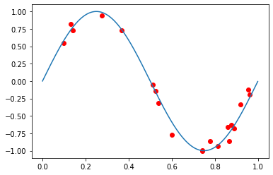
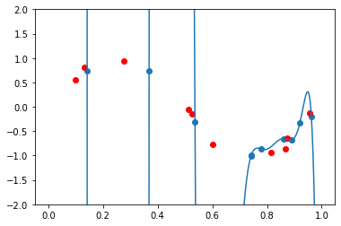
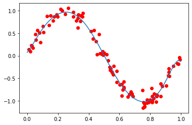
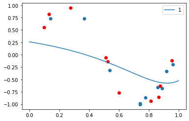
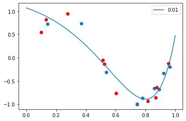
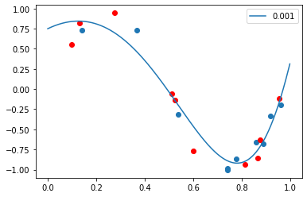

# Assignment1 

{}Download my files{}

## a. Generate 20 data pairs (X, Y) using y = sin(2 * pi * X) + N 


```
import numpy as np
import matplotlib.pyplot as plt

x_sin = np.arange(0,1,0.001)
y_sin = np.sin(2*np.pi*x_sin)

x = np.random.uniform(0,1,20)
print(x)
n = np.random.normal(loc=0,scale=0.1,size=20)
print(n)
y = np.sin(2*np.pi*x) + n
print(y)

plt.plot(x_sin,y_sin)
plt.scatter(x, y, c='red')
plt.show()

```

    [0.77810335 0.86740825 0.89037998 0.87468441 0.52433101 0.09953394
     0.14225487 0.51341408 0.96224468 0.60014106 0.36880038 0.27610704
     0.13260627 0.81387536 0.74190685 0.95440142 0.8593854  0.92008264
     0.53663521 0.74274735]
    [ 0.11975132 -0.11830652 -0.0427414   0.07413593  0.01405541 -0.03515761
     -0.04960479  0.02860095  0.03708894 -0.17848607 -0.00235956 -0.04143945
      0.07631619 -0.01481896 -0.00505041  0.16225375  0.11754572  0.14876444
     -0.08374047  0.00923166]
    [-0.86469916 -0.85832548 -0.678324   -0.63437159 -0.13822602  0.55025605
      0.7298617  -0.05558245 -0.19791602 -0.76698815  0.73174803  0.94513688
      0.8163965  -0.93535703 -1.00375779 -0.12034701 -0.65542328 -0.33253415
     -0.31189891 -0.98973021]





```
from sklearn import model_selection
import pandas as pd
x_train, x_test, y_train, y_test =model_selection.train_test_split(x, y, test_size=0.5)
train_data = pd.DataFrame(data = {'x_train' :x_train, 'y_train': y_train})
print(train_data)
test_data = pd.DataFrame(data = {'x_test' :x_test, 'y_test': y_test})
print(test_data)
```

        x_train   y_train
    0  0.741907 -1.003758
    1  0.742747 -0.989730
    2  0.142255  0.729862
    3  0.536635 -0.311899
    4  0.962245 -0.197916
    5  0.890380 -0.678324
    6  0.920083 -0.332534
    7  0.778103 -0.864699
    8  0.368800  0.731748
    9  0.859385 -0.655423
         x_test    y_test
    0  0.813875 -0.935357
    1  0.874684 -0.634372
    2  0.954401 -0.120347
    3  0.524331 -0.138226
    4  0.132606  0.816396
    5  0.600141 -0.766988
    6  0.513414 -0.055582
    7  0.276107  0.945137
    8  0.867408 -0.858325
    9  0.099534  0.550256


## b. Using root mean square error, find weights of polynomial regression for order is 0, 1, 3, 9


```
from sklearn.preprocessing import PolynomialFeatures
from sklearn.linear_model import LinearRegression

poly_reg_0 =PolynomialFeatures(degree=0)
x_ploy =poly_reg_0.fit_transform(x_train.reshape(10,1))
model_0 = LinearRegression()
model_0.fit(x_ploy,y_train)
coef_0 = [0]*10
coef_0[0] = model_0.coef_[0]

```


```
poly_reg_1 =PolynomialFeatures(degree=1)
x_ploy =poly_reg_1.fit_transform(x_train.reshape(10,1))
model_1 = LinearRegression()
model_1.fit(x_ploy,y_train)
coef_1 = [0]*10
coef_1[0:2] = model_1.coef_[0:2]
```


```
poly_reg_3 =PolynomialFeatures(degree=3)
x_ploy =poly_reg_3.fit_transform(x_train.reshape(10,1))
model_3 = LinearRegression()
model_3.fit(x_ploy,y_train)
model_3.coef_
coef_3 = [0]*10
coef_3[0:4] = model_3.coef_[0:4]
```


```
poly_reg_9 =PolynomialFeatures(degree=9)
x_ploy =poly_reg_9.fit_transform(x_train.reshape(10,1))
model_9 = LinearRegression()
model_9.fit(x_ploy,y_train)
coef_9 = [0]*10
coef_9[0:] = model_9.coef_[0:]
```

## c. Display weights in table 


```
pd.DataFrame(data = {'M=0' :coef_0, 'M=1': coef_1, 'M=3': coef_3, 'M=9': coef_9})
```


<div>
<style scoped>
    .dataframe tbody tr th:only-of-type {
        vertical-align: middle;
    }

    .dataframe tbody tr th {
        vertical-align: top;
    }

    .dataframe thead th {
        text-align: right;
    }
</style>
<table border="1" class="dataframe">
  <thead>
    <tr style="text-align: right;">
      <th></th>
      <th>M=0</th>
      <th>M=1</th>
      <th>M=3</th>
      <th>M=9</th>
    </tr>
  </thead>
  <tbody>
    <tr>
      <th>0</th>
      <td>0.0</td>
      <td>0.00000</td>
      <td>0.000000</td>
      <td>0.000000e+00</td>
    </tr>
    <tr>
      <th>1</th>
      <td>0.0</td>
      <td>-1.77703</td>
      <td>12.724434</td>
      <td>-3.538365e+06</td>
    </tr>
    <tr>
      <th>2</th>
      <td>0.0</td>
      <td>0.00000</td>
      <td>-35.801733</td>
      <td>2.663275e+07</td>
    </tr>
    <tr>
      <th>3</th>
      <td>0.0</td>
      <td>0.00000</td>
      <td>23.827306</td>
      <td>-1.093328e+08</td>
    </tr>
    <tr>
      <th>4</th>
      <td>0.0</td>
      <td>0.00000</td>
      <td>0.000000</td>
      <td>2.746930e+08</td>
    </tr>
    <tr>
      <th>5</th>
      <td>0.0</td>
      <td>0.00000</td>
      <td>0.000000</td>
      <td>-4.429343e+08</td>
    </tr>
    <tr>
      <th>6</th>
      <td>0.0</td>
      <td>0.00000</td>
      <td>0.000000</td>
      <td>4.618127e+08</td>
    </tr>
    <tr>
      <th>7</th>
      <td>0.0</td>
      <td>0.00000</td>
      <td>0.000000</td>
      <td>-3.018078e+08</td>
    </tr>
    <tr>
      <th>8</th>
      <td>0.0</td>
      <td>0.00000</td>
      <td>0.000000</td>
      <td>1.126251e+08</td>
    </tr>
    <tr>
      <th>9</th>
      <td>0.0</td>
      <td>0.00000</td>
      <td>0.000000</td>
      <td>-1.833912e+07</td>
    </tr>
  </tbody>
</table>
</div>


## d. Draw a chart of fit data


```
px = np.arange(0,1,0.001)
px_0 = poly_reg_0.fit_transform(px.reshape(1000, 1))
py_0 = model_0.predict(px_0)

plt.plot(px, py_0)
plt.scatter(x_train, y_train)
plt.scatter(x_test, y_test, c = 'r')
plt.show()

```


```
px = np.arange(0,1,0.001)
px_1 = poly_reg_1.fit_transform(px.reshape(1000, 1))
py_1 = model_1.predict(px_1)

plt.plot(px, py_1)
plt.scatter(x_train, y_train)
plt.scatter(x_test, y_test, c = 'r')
plt.show()
```


```
px = np.arange(0,1,0.001)
px_3 = poly_reg_3.fit_transform(px.reshape(1000, 1))
py_3 = model_3.predict(px_3)

plt.plot(px, py_3)
plt.scatter(x_train, y_train)
plt.scatter(x_test, y_test, c = 'r')
plt.show()
```


```
px = np.arange(0,1,0.001)
px_9 = poly_reg_9.fit_transform(px.reshape(1000, 1))
py_9 = model_9.predict(px_9)

plt.plot(px, py_9)
plt.scatter(x_train, y_train)
plt.scatter(x_test, y_test, c = 'r')
plt.ylim(-2. ,2.)
plt.show()
```





## e. Draw train error vs test error


```
import sklearn.metrics as metrics


def poly_regression(degree):
  poly_reg =PolynomialFeatures(degree=degree)
  x_ploy =poly_reg.fit_transform(x_train.reshape(10,1))
  model = LinearRegression()
  model.fit(x_ploy,y_train)
  return poly_reg, model

train_error = []
test_error = []

for i in range(10):
  poly_reg ,model = poly_regression(i)

  x_ploy = poly_reg.fit_transform(x_train.reshape(10,1))
  y_pred = model.predict(x_ploy)
  train_error.append(metrics.mean_squared_error(y_train, y_pred))

  x_ploy = poly_reg.fit_transform(x_test.reshape(10,1))
  y_pred = model.predict(x_ploy)
  test_error.append(metrics.mean_squared_error(y_test, y_pred))

print(train_error)
print(test_error)


xx = np.arange(0,10,1)
plt.ylim(0 ,1)
plt.xlim(0,9)
plt.plot(xx, test_error, label = "$test_error$", c = 'r')
plt.plot(xx, train_error, label = "$train_error$", c = 'b')

plt.xlabel('Orders')

plt.legend()

```

    [0.36632874862534986, 0.16559427974674773, 0.1020036099297481, 0.008568466592971705, 0.0029409738692365963, 0.002873189496895936, 0.002763181493865059, 0.0014591645681341476, 1.4778327453226064e-05, 1.1555551499236159e-15]
    [0.49223714355226617, 0.13679238064249566, 0.14712574276306922, 0.010235827830824273, 0.028444576941675064, 0.020749789279053743, 0.10333569591446992, 300.62165614339943, 160006.38446116907, 26062843.272267506]


    <matplotlib.legend.Legend at 0x7f7acc81c438>


## f. Now generate 100 more data and fit 9th order model and draw fit


```
x = np.random.uniform(0,1,100)
n = np.random.normal(loc=0,scale=0.1,size=100)
y = np.sin(2*np.pi*x) + n

poly_reg_9 =PolynomialFeatures(degree=9)
x_ploy =poly_reg_9.fit_transform(x.reshape(100,1))
model_9 = LinearRegression()
model_9.fit(x_ploy,y)

px = np.arange(0,1,0.001)
px_9 = poly_reg_9.fit_transform(px.reshape(1000, 1))
py_9 = model_9.predict(px_9)

plt.plot(px, py_9)
plt.scatter(x, y, c = 'r')
plt.show()
```





## g. Regularize using the sum of weights.
## h. Draw chart for lamda


```
from sklearn.linear_model import Ridge
import math

def ridgeRegession(x, y, degree, alpha):
  print(math.log(alpha))
  poly_reg =PolynomialFeatures(degree=degree)
  x_ploy =poly_reg.fit_transform(x.reshape(10,1))
  model = Ridge(alpha = alpha)
  model.fit(x_ploy,y)

  px = np.arange(0, 1,0.001)
  px_9 = poly_reg.fit_transform(px.reshape(1000, 1))
  py_9 = model.predict(px_9)

  plt.plot(px, py_9, label=alpha)
  plt.scatter(x_train, y_train)
  plt.scatter(x_test, y_test, c = 'r')
  plt.legend()
  plt.show()


```


```
ridgeRegession(x_train, y_train, 9, 1)
```

    0.0





```
ridgeRegession(x_train, y_train, 9, 0.1)
```

    -2.3025850929940455


```
ridgeRegession(x_train, y_train, 9, 0.01)
```

    -4.605170185988091





```
ridgeRegession(x_train, y_train, 9, 0.001)
```

    -6.907755278982137





```
ridgeRegession(x_train, y_train, 9, 0.0001)
```

    -9.210340371976182


```
ridgeRegession(x_train, y_train, 9, 0.00001)
```

    -11.512925464970229


## i. Draw test and train error according to lamda


```
train_error = []
test_error = []

def ridgeRegession2(x, y, degree, alpha):

  poly_reg =PolynomialFeatures(degree=degree)
  x_ploy =poly_reg.fit_transform(x.reshape(10,1))
  model = Ridge(alpha = alpha)
  model.fit(x_ploy,y)
  return poly_reg, model

px = np.linspace(-35, 0, 350)
for i in px:
  alpha = math.exp(i) 
  poly_reg, model = ridgeRegession2(x_train, y_train, 9 , alpha)

  x_ploy = poly_reg.fit_transform(x_train.reshape(x_train.shape[0],1))
  y_pred = model.predict(x_ploy)
  train_error.append(metrics.mean_squared_error(y_train, y_pred))

  x_ploy = poly_reg.fit_transform(x_test.reshape(x_test.shape[0],1))
  y_pred = model.predict(x_ploy)
  test_error.append(metrics.mean_squared_error(y_test, y_pred))

# xx = np.arange(0,10,1)
plt.ylim(0 ,0.7)
plt.xlim(-25,0)
plt.plot(px, test_error, label = "$test_error$", c = 'r')
plt.plot(px, train_error, label = "$train_error$", c = 'b')

plt.xlabel('ln(lamdba)')
plt.legend()
```

    /usr/local/lib/python3.6/dist-packages/sklearn/linear_model/_ridge.py:148: LinAlgWarning: Ill-conditioned matrix (rcond=7.15088e-17): result may not be accurate.
      overwrite_a=True).T
    /usr/local/lib/python3.6/dist-packages/sklearn/linear_model/_ridge.py:148: LinAlgWarning: Ill-conditioned matrix (rcond=7.15088e-17): result may not be accurate.
      overwrite_a=True).T
    /usr/local/lib/python3.6/dist-packages/sklearn/linear_model/_ridge.py:148: LinAlgWarning: Ill-conditioned matrix (rcond=8.58104e-17): result may not be accurate.
      overwrite_a=True).T
    /usr/local/lib/python3.6/dist-packages/sklearn/linear_model/_ridge.py:148: LinAlgWarning: Ill-conditioned matrix (rcond=1.0858e-16): result may not be accurate.
      overwrite_a=True).T
    /usr/local/lib/python3.6/dist-packages/sklearn/linear_model/_ridge.py:148: LinAlgWarning: Ill-conditioned matrix (rcond=1.0858e-16): result may not be accurate.
      overwrite_a=True).T


    <matplotlib.legend.Legend at 0x7f7acc83ea20>


## j. Best model? 


```
index = test_error.index(min(test_error))
best_ln_lambda = px[index]
best_lambda = math.exp(best_ln_lambda)
print('Best model: ln(lambda) = ', best_ln_lambda)
print('Best model: lamda = ', best_lambda)
```

    Best model: ln(lambda) =  -10.830945558739256
    Best model: lamda =  1.9777896964349035e-05

